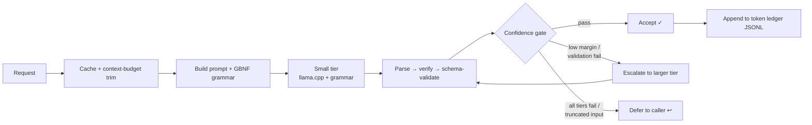

<div align="center">

# local-offload

**Delegate the grunt work to a free local model — keep your cloud tokens for judgment.**

A local-first harness that offloads short-context, low-judgment work — **summarize · classify · extract · triage** (plus vision, OCR, transcription, and image/SVG generation) — to a free **Gemma-family cascade** served by [llama.cpp](https://github.com/ggml-org/llama.cpp). It runs as a Go CLI and as an **MCP server** for AI coding agents. It **never calls a cloud model**: when it can't do a task confidently, it returns a structured **defer** so your agent handles it.

[](LICENSE)
[](https://pkg.go.dev/github.com/dmmdea/offload-harness)
[](../../actions)
[](https://modelcontextprotocol.io)

</div>

---

## What & why

When an agent (or you) needs to summarize a log, label a ticket, pull fields out of a document, or answer a yes/no question about some text, that work is **mechanical and low-judgment** — but it still costs context window and cloud tokens. `local-offload` runs those tasks on a **free local model** so the bulk, low-value tokens never enter your expensive context. A built-in **ledger** reports exactly how many tokens you saved.

The design rule is simple: **the local model does grunt work; your agent keeps all judgment.** Every task either returns a verified, schema-valid result or **defers** — a structured `{"deferred": true, ...}` that tells the caller "do this one yourself." There is no cloud fallback inside the harness, and it holds no cloud credentials.

It's for anyone running an AI coding agent or pipeline who wants to **cut token spend on bulk text work** while keeping data on the box.

## Features

- **Free & fully local** — all inference runs on your GPU via llama.cpp; no API keys, no metering, nothing leaves the machine.
- **Never calls cloud, always defers** — low confidence returns a structured defer instead of guessing. The core offload path has no cloud credentials by design (the opt-in `nim` remote tool below is the one explicit, deliberate exception).
- **Self-learning cascade** — fast tasks enter at a small tier and escalate to a larger model only when genuinely uncertain (logprob decision margin + self-reported confidence).
- **Reliable structured output** — enforces a generated **GBNF grammar** + Go schema validation, working around the model's JSON-schema crashes.
- **Single static binary** — one Go executable; CLI and MCP server in the same build.
- **MCP-native** — exposes 15 tools over stdio for any MCP client (Claude Code and friends).
- **Beyond text** — local **vision** (VQA / OCR / image-field-extract / render-QA), **speech-to-text** (whisper.cpp), **image/audio/video generation** (SDXL · Chatterbox TTS · ACE-Step · Hunyuan via ComfyUI), and a dependency-free **SVG data-viz kit**.
- **Optional remote escalation** — an explicit, opt-in `nim` tool reaches any OpenAI-compatible **NVIDIA NIM** endpoint (NVIDIA's hosted [build.nvidia.com](https://build.nvidia.com) free-model catalog, or a self-hosted NIM) for the rare task that needs a frontier model the local GPU can't run. Key from env only; never ledgered; the local cascade is untouched.
- **Token ledger** — append-only JSONL accounting of every offloaded call and the cloud tokens it saved.

## Quickstart

```bash
# 1. Build (Go 1.26+)
go build -o local-offload .

# 2. Point at your local llama.cpp endpoint (defaults assume http://127.0.0.1:11436)
#    ./config.json is picked up automatically when run from this directory;
#    for a global install put it at ~/.local-offload/config.json instead.
cp config.example.json config.json

# 3. Run a task — input is a file path or "-" for stdin
./local-offload summarize notes.md --max-points 5 --json
./local-offload triage log.txt --question "Does this contain an error?" --json

# 4. See what you saved
./local-offload ledger
```

First output in under five commands. If the local model is unreachable or unsure, you'll get `{"deferred": true, "reason": "..."}` — that's expected, not a failure.

## Installation

**Build from source** (recommended):

```bash
git clone https://github.com/dmmdea/offload-harness.git
cd local-offload
go build -o local-offload .       # or: go build -o local-offload.exe . on Windows
```

**Go install:**

```bash
go install github.com/dmmdea/offload-harness@latest
```

Requires **Go 1.26+** and a running **llama.cpp server** (see [Serving the models](#serving-the-models)).

## Usage (CLI)

```bash
# Text — the four core tasks
local-offload summarize <file|-> [--max-points N] [--json]
local-offload classify  <file|-> --labels bug,feature,question [--json]
local-offload extract   <file|-> --schema fields.json [--json]
local-offload triage    <file|-> --question "Is this a refund request?" [--json]

# Vision (image understanding)
local-offload vqa           image.png --question "What number is shown?" --json
local-offload ocr           scan.png --json
local-offload extract-image invoice.png --schema fields.json --json
local-offload assess-image  render.png --brief "a red sports car at sunset" --json

# Speech-to-text (audio or video)
local-offload transcribe    clip.mp4 --language es --json
local-offload transcribe    noisy.m4a --language es --hq        # high-quality model for hard audio

# Video understanding (samples frames)
local-offload video-describe clip.mp4 --question "What happens here?" --json

# Generate (free, local GPU)
local-offload generate-image "a product photo of a coffee mug on white" --negative "people, text, watermark"
local-offload generate-svg gauge '{"value":72,"max":100,"label":"Score","unit":"%"}'

# Remote escalation (explicit, opt-in — NVIDIA NIM; needs NVIDIA_API_KEY for the free hosted catalog)
local-offload nim --list-models                                            # browse available model ids
local-offload nim "Explain MoE routing in 3 bullets" --model nvidia/nemotron-3-ultra-550b-a55b --max-tokens 600
local-offload nim "Summarize this" --model meta/llama-3.3-70b-instruct --base http://127.0.0.1:8000/v1  # self-hosted NIM (keyless)

# Operate & inspect
local-offload mcp                      # run as an MCP server (stdio)
local-offload ledger [--since DAYS]    # token-savings report
local-offload doctor                   # endpoint health + config check
local-offload models                   # show configured models + serving flags
local-offload eval [--dir DIR]         # code-based quality eval (AURC, deferral-curve AUDC/QNC)
local-offload stats                    # per-task ledger telemetry
```

Input is a **file path** or `-` for stdin. Add `--json` for the full result object, `--select a,b,c` to keep only certain top-level fields, and `--compact` to minify. Configuration is read from `--config <path>` or `$LOCAL_OFFLOAD_CONFIG`.

<details>
<summary><b>Example: extract structured fields</b></summary>

`fields.json` is a JSON Schema with a `properties` map:

```json
{ "properties": { "name": { "type": "string" }, "amount": { "type": "number" }, "date": { "type": "string" } } }
```

```bash
local-offload extract invoice.txt --schema fields.json --json
# -> {"name":"...","amount":1240.50,"date":"2026-01-15"}   (values grounded in the input text)
```

A bare `{"field":"string"}` map has no usable properties and is deferred.

</details>

<details>
<summary><b>Self-learning jobs (offline, inference-free)</b></summary>

These run as a nightly batch over the ledger — pure Go statistics, **zero cloud tokens**:

```bash
local-offload calibrate           # per-task conformal escalation thresholds  -> thresholds.json
local-offload health              # per-tier EWMA/Page-Hinkley/CUSUM + P95 timeouts -> tier_overrides.json
local-offload train-router        # logistic entry-tier router from input features -> router-weights.json
local-offload optimize            # mine verified-good calls into few-shot exemplar pools
local-offload audit-sample --hard # surface the hardest cases for human/agent review
```

See [How the cascade learns](#how-the-cascade-learns).

</details>

## Use as an MCP server

Register the binary with your MCP client. The built-in defaults already encode the full cascade, so `--config` is only needed for non-default endpoints or paths.

```bash
claude mcp add local-offload --scope user -- /path/to/local-offload mcp
```

Or add it to your client's MCP config directly:

```json
{
  "mcpServers": {
    "local-offload": {
      "command": "/path/to/local-offload",
      "args": ["mcp"]
    }
  }
}
```

Transport is **stdio**. Every tool returns the full result JSON — and a `{"deferred": true, ...}` defer is a *valid* result, signalling the agent to do that task itself.

### Exposed MCP tools

| Tool | Arguments | What it does |
|---|---|---|
| `offload_summarize` | `text`, `max_points?` | Summarize text → `{summary, bullets}`, or defer. |
| `offload_classify` | `text`, `labels[]` | Classify into one of the labels → `{label, confidence}`, or defer. |
| `offload_extract` | `text`, `schema` | Extract schema-constrained fields → object, or defer. Values grounded in the input. |
| `offload_triage` | `text`, `question` | Yes/no/unsure check → `{decision, reason}`, or defer. |
| `offload_vqa` | `image`, `question` | Visual Q&A on a local image → `{answer}`, or defer. |
| `offload_ocr` | `image` | Transcribe all text in an image → `{text}`, or defer. |
| `offload_extract_image` | `image`, `schema` | OCR then extract grounded fields from the image → object, or defer. |
| `offload_assess_image` | `image`, `brief?` | QA a render against exclusions → `{has_people, has_text, matches_brief, notes}`. |
| `offload_video_describe` | `video`, `question` | Sample frames from a local video and answer → `{answer}`, or defer. |
| `offload_transcribe` | `audio`, `language?`, `hq?`, `select?` | Transcribe local audio/video → `{gist, segments[], srt_path, ...}`, or defer. |
| `offload_generate_image` | `prompt`, `negative?`, `width?`, `height?`, `steps?`, `seed?`, `out?` | Generate an image on the local GPU (SDXL/ComfyUI) → `{image_path, ...}`, or defer. |
| `offload_generate_svg` | `kind`, `spec`, `out?` | Render a crisp data-viz SVG (`gauge` · `comparison-bar` · `chromatogram` · `icon`) — no model, no GPU. |
| `offload_generate_audio` | `text`, `kind?`, `clone?`, `lang?`, `seconds?`, `seed?`, `out?` | Synthesize voice (Chatterbox TTS) or music (ACE-Step) on the local GPU → `{audio_path, ...}`, or defer. |
| `offload_generate_video` | `prompt`, `still?`, `model?`, `frames?`, `seed?`, `out?` | Animate a still into a short clip (Hunyuan I2V) on the local GPU → `{video_path, seed}`, or defer. |
| `offload_nim` | `prompt`, `model?`, `system?`, `base?`, `max_tokens?`, `temperature?`, `list_models?` | **Opt-in remote.** Call an NVIDIA NIM endpoint (hosted free catalog or self-hosted) → `{model, content, ...}`, or defer. Key from `$NVIDIA_API_KEY` (sent only to NVIDIA hosts); never ledgered. |

> **Inputs stay local.** Images, audio, and video are accepted as a **local file path** or a `data:` URI — **never a remote URL**, so there is no network egress for media.

## How it works

The pipeline is a confidence-gated cascade. A request enters at a small tier and only climbs when the result is genuinely uncertain; if every local tier is exhausted, it defers to the caller.



**The cascade.** Tasks enter at the tier sized to the job and escalate only on a validation failure *or* a low decision-confidence signal:

- **triage / classify** → small fast tier (entry)
- **summarize / extract** → mid workhorse tier
- on failure or uncertainty → escalate to a larger near-frontier MoE tier
- all local tiers fail → **defer** to the caller

**Confidence-based escalation.** For triage/classify the harness requests per-token logprobs and computes a **class-mass margin** at the decision token (the raw pre-grammar distribution, aggregated by legal class so `Yes`/`yes` don't split). A margin below the threshold means the model was torn → escalate instead of accepting a coin-flip. Classify also keeps a self-reported confidence gate (defense in depth).

**Reliable structured output.** The target model crashes on llama.cpp's `--json-schema` / `response_format`, so the harness instead enforces a **GBNF grammar** (generated per request, no external dependency) via the chat-completions `grammar` field, then forgivingly parses and schema-validates the result in Go. Extracted values must appear verbatim in the source text (grounding).

**State.** The cache is [bbolt](https://github.com/etcd-io/bbolt) (single-writer); the token **ledger is append-only JSONL**, so a CLI run and the long-running MCP server can both append concurrently. If the MCP server holds the cache lock, a concurrent CLI run degrades to cache-less automatically rather than failing.

### How the cascade learns

The harness improves itself **offline and inference-free** — pure Go statistics over the ledger, spending **zero cloud tokens**:

- **Conformal thresholds** (`calibrate`) — replaces a guessed margin gate with a per-task threshold that holds a chosen error rate.
- **Entry-tier router** (`train-router`) — a tiny logistic model on cheap input features bumps the entry tier up when the small tier is predicted to fail, cutting wasted escalation.
- **Health monitoring + circuit breakers** (`health`) — flags degrading tiers (EWMA / Page-Hinkley / CUSUM), sets P95 timeouts, and routes around a tier that is OOMing or timing out (infra only — never on a quality defer).
- **Few-shot exemplars** (`optimize`) — harvests verified-good `(input, output)` pairs and BM25-selects them into the prompt (opt-in via `exemplar_shots`).
- **Shadow-labeling flywheel** — optionally captures a fraction of live calls, replays them counterfactually through other tiers to generate training labels for the router and confidence head, then trains and calibrates them behind an adoption gate that only promotes a change when it **provably lowers error**.

## Configuration

Copy `config.example.json` and edit. Config is resolved in precedence order: `--config <path>` > `$LOCAL_OFFLOAD_CONFIG` > `./config.json` > `~/.local-offload/config.json` > built-in defaults. A leading `~/` in any path-typed value expands to your home directory; an unknown key warns to stderr rather than being silently dropped.

| Key | Default | Purpose |
|---|---|---|
| `endpoint` | `http://127.0.0.1:11436` | Base URL of the local llama.cpp server. |
| `completion_path` | `/v1/chat/completions` | Chat-completions path. |
| `model` | `offload-e4b` | Workhorse text tier (summarize / extract). |
| `triage_model` | `gemma4-e2b` | Fast entry tier (triage / classify); empty = use `model`. |
| `escalation_model` | `gemma4-26b-a4b` | Larger tier tried before deferring; empty = no escalation. |
| `vision_model` | `qwen3vl-4b` | Local vision tier (VQA / OCR / image extract / assess). |
| `stt_model` / `stt_model_hq` | `whisper-stt` / `whisper-stt-hq` | Speech-to-text upstreams (turbo / high-quality). |
| `classify_min_confidence` | `0.45` | Self-reported confidence floor for classify. |
| `confidence_margin_threshold` | `0.35` | Logprob decision margin gate (0 disables). |
| `max_input_chars` | `24000` | Inputs above this are trimmed; over-long inputs defer. |
| `max_retries` | `1` | Retries before escalating. |
| `cache_path` | `~/.local-offload/cache.db` | bbolt cache file. |
| `ledger_path` | `~/.local-offload/ledger.jsonl` | Append-only token-savings ledger. |
| `exemplar_shots` | `0` | Few-shot exemplars to inject (0 = off). |
| `auto_heal` | `false` | Auto-warmup a tripped tier's circuit breaker. |
| `opus_input_price_per_mtok` | `15.0` | Price used to value tokens saved in the ledger. |
| `request_timeout_sec` | `120` | Per-request timeout. |

State (cache, ledger, learned weights, exemplars) defaults to `~/.local-offload/`.

## Serving the models

All tiers are served by a local **llama.cpp server** (multiplexed with a model-swapper such as [llama-swap](https://github.com/mostlygeek/llama-swap) so only one model occupies the GPU at a time; the harness's default endpoint is `http://127.0.0.1:11436`). The harness talks to it over the standard chat-completions API. The text cascade fits comfortably on an 8 GB GPU.

**Automated setup (Linux + NVIDIA):** `skill/scripts/detect.sh` checks your hardware/toolchain (read-only), and `skill/scripts/setup.sh` is an idempotent installer — it builds a recent llama.cpp, pulls the Gemma-4 QAT model family, writes the grammar-reliable serving config, and builds the harness. Both are driven entirely by env-var overrides (`MODELS_ROOT`, `LLAMACPP_DIR`, `LLAMASWAP_CONFIG`, `LLAMASWAP_PORT`, …) — see the headers of each script. `skill/` also contains an agent-installable skill for MCP clients like Claude Code.

Verified **grammar-reliable** serving flags (per tier):

```bash
# common
--ctx-size 8192 --flash-attn on --cache-type-k f16 --cache-type-v f16 --jinja --reasoning off

# small entry tier:     --n-gpu-layers 99
# workhorse tier:       --n-gpu-layers 99 --parallel 1
# large MoE escalation: --cpu-moe --n-gpu-layers 999 --parallel 1   (env GGML_CUDA_DISABLE_GRAPHS=1)
```

<details>
<summary><b>Serving gotchas (load-bearing)</b></summary>

- **`--reasoning off` is mandatory** — the model's thinking mode otherwise eats the short output budget and returns empty replies.
- **No speculative draft (MTP)** — it 500-errors on the grammar field. Serve with flash-attention on, f16 KV, reasoning off.
- **Never use `--json-schema` / `response_format`** — they crash the model; the harness passes a raw GBNF `grammar` field instead.
- **Vision: use the Instruct build** of the VLM (the Thinking variant silently bypasses GBNF) and keep the multimodal projector at **F16** for OCR (Q8 hallucinates text).
- **Speech-to-text: flash-attention OFF** server-side — it degrades non-English / noisy transcription; turbo is still 5–8× realtime.

</details>

## Requirements

| | |
|---|---|
| **OS** | Linux, macOS, Windows |
| **Go** | 1.26+ (to build) |
| **GPU** | NVIDIA, ~8 GB VRAM for the text + vision cascade |
| **RAM / disk** | 32 GB+ system RAM and a fast SSD recommended (model weights, MoE CPU offload) |
| **External** | a running llama.cpp server; `ffmpeg` on PATH for audio/video; a whisper.cpp server for STT; ComfyUI for image generation (all optional per feature) |

## Troubleshooting

<details>
<summary><b>Every call returns <code>deferred: true</code></b></summary>

Check the endpoint with `local-offload doctor`. The most common cause is the llama.cpp server not running or not reachable at `endpoint`. A defer is also normal for low-confidence, truncated, or over-long inputs — those are meant to go back to the caller.

</details>

<details>
<summary><b>Empty or truncated model output</b></summary>

You're almost certainly serving with reasoning mode on. Add `--reasoning off` to the llama.cpp server. Also confirm you are **not** passing `--json-schema` / `response_format` — both crash the model and break the grammar path.

</details>

<details>
<summary><b>OCR or image fields look wrong</b></summary>

Use the **Instruct** vision build (not Thinking) and keep the multimodal projector at **F16**. Validate dense documents before trusting them — fine-detail OCR on the server has a known accuracy regression for very small text.

</details>

<details>
<summary><b>"cache unavailable (held by the MCP server?)"</b></summary>

Expected. The bbolt cache is single-writer; when the long-running MCP server holds it, a concurrent CLI run continues cache-less. The JSONL ledger is unaffected — both can append.

</details>

## Contributing

Contributions welcome. Run `go test ./...` and `go vet ./...` before opening a PR, and keep changes scoped. See `CONTRIBUTING.md` for build/test details.

## Security

Everything runs **locally** — no cloud calls, no credentials, no media egress (inputs are local paths or `data:` URIs only). To report a vulnerability, please see `SECURITY.md` rather than opening a public issue.

## License

[Apache 2.0](LICENSE).

## Acknowledgments

Built on [llama.cpp](https://github.com/ggml-org/llama.cpp) and [whisper.cpp](https://github.com/ggml-org/whisper.cpp), the [Gemma](https://ai.google.dev/gemma) and [Qwen-VL](https://github.com/QwenLM/Qwen3-VL) model families, [ComfyUI](https://github.com/comfyanonymous/ComfyUI), the [Model Context Protocol Go SDK](https://github.com/modelcontextprotocol/go-sdk), and [bbolt](https://github.com/etcd-io/bbolt).
