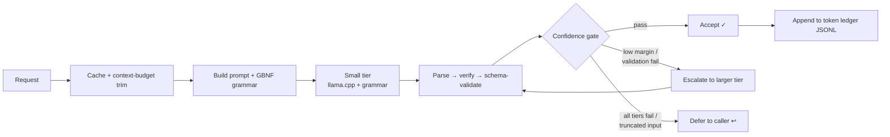

<div align="center">

# offload-harness

**Delegate the grunt work to a free local model — keep your cloud tokens for judgment.**

A local-first harness that offloads short-context, low-judgment work — **summarize · classify · extract · triage** (plus vision, OCR, transcription, and image/SVG generation) — to a free **Gemma-family cascade** served by [llama.cpp](https://github.com/ggml-org/llama.cpp). It runs as a Go CLI and as an **MCP server** for AI coding agents. It **never calls a cloud model**: when it can't do a task confidently, it returns a structured **defer** so your agent handles it.

[](LICENSE)
[](https://pkg.go.dev/github.com/dmmdea/offload-harness)
[](https://modelcontextprotocol.io)

</div>

---

## What & why

When an agent (or you) needs to summarize a log, label a ticket, pull fields out of a document, or answer a yes/no question about some text, that work is **mechanical and low-judgment** — but it still costs context window and cloud tokens. `offload-harness` runs those tasks on a **free local model** so the bulk, low-value tokens never enter your expensive context. A built-in **ledger** reports exactly how many tokens you saved.

The design rule is simple: **the local model does grunt work; your agent keeps all judgment.** Every task either returns a verified, schema-valid result or **defers** — a structured `{"deferred": true, ...}` that tells the caller "do this one yourself." There is no cloud fallback inside the harness, and it holds no cloud credentials.

It's for anyone running an AI coding agent or pipeline who wants to **cut token spend on bulk text work** while keeping data on the box.

## Features

- **Free & fully local** — all inference runs on your GPU via llama.cpp; no API keys, no metering, nothing leaves the machine.
- **Never calls cloud, always defers** — low confidence returns a structured defer instead of guessing. The core offload path has no cloud credentials by design (the opt-in `nim` remote tool below is the one explicit, deliberate exception).
- **Self-learning cascade** — fast tasks enter at a small tier and escalate to a larger model only when genuinely uncertain (logprob decision margin + self-reported confidence).
- **Reliable structured output** — enforces a generated **GBNF grammar** + Go schema validation, working around the model's JSON-schema crashes.
- **Single static binary** — one Go executable; CLI and MCP server in the same build.
- **MCP-native** — exposes 16 tools over stdio for any MCP client (Claude Code and friends), including a read-only local agent (`agent_run`).
- **Beyond text** — local **vision** (VQA / OCR / image-field-extract / render-QA), **speech-to-text** (whisper.cpp), **image/audio/video generation** (SDXL · Chatterbox TTS · ACE-Step · Hunyuan via ComfyUI), and a dependency-free **SVG data-viz kit**.
- **Optional remote escalation** — an explicit, opt-in `nim` tool reaches any OpenAI-compatible **NVIDIA NIM** endpoint (NVIDIA's hosted [build.nvidia.com](https://build.nvidia.com) free-model catalog, or a self-hosted NIM) for the rare task that needs a frontier model the local GPU can't run. Key from env only; never ledgered; the local cascade is untouched.
- **Token ledger** — append-only JSONL accounting of every offloaded call and the cloud tokens it saved.

## Quickstart

```bash
# 1. Build (Go 1.26+)
go build -o offload-harness .

# 2. Point at your local llama.cpp endpoint (defaults assume http://127.0.0.1:11436)
#    ./config.json is picked up automatically when run from this directory;
#    for a global install put it at ~/.local-offload/config.json instead.
cp config.example.json config.json

# 3. Run a task — input is a file path or "-" for stdin
./offload-harness summarize notes.md --max-points 5 --json
./offload-harness triage log.txt --question "Does this contain an error?" --json

# 4. See what you saved
./offload-harness ledger
```

First output in under five commands. If the local model is unreachable or unsure, you'll get `{"deferred": true, "reason": "..."}` — that's expected, not a failure.

## Set up with your AI agent

The fastest path on Windows is to let your coding agent install the whole stack for you. Point
**Claude Code** (or any capable agent) at this repo and say:

> *Follow `setup/SETUP-AGENT.md` and install the stack.*

That runbook is written **for an agent**: it runs three idempotent PowerShell scripts —
`setup/detect.ps1` (pick the backend: CUDA / Vulkan / CPU) → `setup/install.ps1` (pinned llama.cpp +
llama-swap binaries, the Gemma-4 models, the Go build) → `setup/selftest.ps1` (a machine-readable
receipt with a deep-context canary) — and branches on the JSON each one emits. It never substitutes a
pinned asset and never installs CUDA/ROCm (the release binaries carry their own runtime; Vulkan uses
the GPU driver).

**Manual alternative** (same three steps):

```powershell
pwsh -NoProfile -File setup\detect.ps1
pwsh -NoProfile -File setup\install.ps1
pwsh -NoProfile -File setup\selftest.ps1
```

## Installation

**Build from source** (recommended):

```bash
git clone https://github.com/dmmdea/offload-harness.git
cd offload-harness
go build -o offload-harness .       # or: go build -o offload-harness.exe . on Windows
```

**Go install:**

```bash
go install github.com/dmmdea/offload-harness@latest
```

Requires **Go 1.26+** and a running **llama.cpp server** (see [Serving the models](#serving-the-models)).

## Usage (CLI)

```bash
# Text — the four core tasks
offload-harness summarize <file|-> [--max-points N] [--json]
offload-harness classify  <file|-> --labels bug,feature,question [--json]
offload-harness extract   <file|-> --schema fields.json [--json]
offload-harness triage    <file|-> --question "Is this a refund request?" [--json]

# Vision (image understanding)
offload-harness vqa           image.png --question "What number is shown?" --json
offload-harness ocr           scan.png --json
offload-harness extract-image invoice.png --schema fields.json --json
offload-harness assess-image  render.png --brief "a red sports car at sunset" --json

# Speech-to-text (audio or video)
offload-harness transcribe    clip.mp4 --language es --json
offload-harness transcribe    noisy.m4a --language es --hq        # high-quality model for hard audio

# Video understanding (samples frames)
offload-harness video-describe clip.mp4 --question "What happens here?" --json

# Generate (free, local GPU)
offload-harness generate-image "a product photo of a coffee mug on white" --negative "people, text, watermark"
offload-harness generate-image --batch jobs.jsonl   # N prompts through ONE warm ComfyUI session (checkpoint loads once)
offload-harness run-graph --graph wf.json --manifest m.json --out-dir out/   # arbitrary ComfyUI graph + self-provisioned node manifest
offload-harness edit-image render.png --ops '[{"op":"mask_boxes","boxes":[{"x":620,"y":540,"width":820,"height":820}],"feather":6}]' --out mask.png   # build a white-on-black inpaint mask
offload-harness edit-image render.png --ops '[{"op":"grade","levels":{"black":8,"white":248,"gamma":1.05},"wb":{"mode":"gray_world"}},{"op":"resize","width":1920},{"op":"finish"}]' --renditions '[{"width":1080,"format":"webp","suffix":"-ig"}]'   # grade -> resize -> delivery sharpen (+ export matrix)
offload-harness edit-image template.xcf --ops '[{"op":"instantiate_design","set_text":{"Headline":"Hola Bogotá"},"replace_image":{"ProductShot":"D:/renders/watch.png"}},{"op":"resize","width":1080}]'   # GIMP template factory: new copy + swapped product, then PIL ops
offload-harness inpaint-image render.png --mask mask.png --prompt "clean glossy dial, no writing"   # re-render ONLY the masked region (white = repaint)
offload-harness generate-svg gauge '{"value":72,"max":100,"label":"Score","unit":"%"}'

# Remote escalation (explicit, opt-in — NVIDIA NIM; needs NVIDIA_API_KEY for the free hosted catalog)
offload-harness nim --list-models                                            # browse available model ids
offload-harness nim "Explain MoE routing in 3 bullets" --model nvidia/nemotron-3-ultra-550b-a55b --max-tokens 600
offload-harness nim "Summarize this" --model meta/llama-3.3-70b-instruct --base http://127.0.0.1:8000/v1  # self-hosted NIM (keyless)

# Operate & inspect
offload-harness mcp                      # run as an MCP server (stdio)
offload-harness fleet-serve              # join the fleet-dispatcher fleet (health/dispatch/jobs on :18811)
offload-harness fleet-measure            # prime the fleet footprint store (one minimal render per configured task)
offload-harness ledger [--since DAYS]    # token-savings report
offload-harness doctor                   # endpoint health + config check
offload-harness models                   # show configured models + serving flags
offload-harness eval [--dir DIR]         # code-based quality eval (AURC, deferral-curve AUDC/QNC)
offload-harness stats                    # per-task ledger telemetry
```

Input is a **file path** or `-` for stdin. Add `--json` for the full result object, `--select a,b,c` to keep only certain top-level fields, and `--compact` to minify. Configuration is read from `--config <path>` or `$LOCAL_OFFLOAD_CONFIG`.

<details>
<summary><b>Example: warm-batch image generation</b></summary>

`generate-image --batch jobs.jsonl` renders every job through **one warm ComfyUI session** — the checkpoint loads once instead of once per image, and the zero-always-warm teardown (free VRAM, kill the spawned ComfyUI, release the GPU lock) runs at the **batch boundary**. One JSON object per line; `prompt` is required, everything else optional (`out`, `negative`, `width`, `height`, `steps`, `seed` — a missing seed is minted, a missing out defaults under the media dir):

```jsonl
{"prompt":"a red vintage bicycle against a white brick wall","seed":4242,"out":"C:/renders/bike.png"}
{"prompt":"a green apple on a slate table, studio light","seed":99}
{"prompt":"a paper sailboat on a calm pond at golden hour"}
```

The result is a summary: `{"count":3,"succeeded":3,"failed":0,"items":[{"out":...,"seed":...,"ok":true,"ms":...},...]}`. A single failed render is recorded in its item and does not abort the batch.

</details>

<details>
<summary><b>Example: extract structured fields</b></summary>

`fields.json` is a JSON Schema with a `properties` map:

```json
{ "properties": { "name": { "type": "string" }, "amount": { "type": "number" }, "date": { "type": "string" } } }
```

```bash
offload-harness extract invoice.txt --schema fields.json --json
# -> {"name":"...","amount":1240.50,"date":"2026-01-15"}   (values grounded in the input text)
```

A bare `{"field":"string"}` map has no usable properties and is deferred.

</details>

<details>
<summary><b>Self-learning jobs (offline, inference-free)</b></summary>

These run as a nightly batch over the ledger — pure Go statistics, **zero cloud tokens**:

```bash
offload-harness calibrate           # per-task conformal escalation thresholds  -> thresholds.json
offload-harness health              # per-tier EWMA/Page-Hinkley/CUSUM + P95 timeouts -> tier_overrides.json
offload-harness train-router        # logistic entry-tier router from input features -> router-weights.json
offload-harness optimize            # mine verified-good calls into few-shot exemplar pools
offload-harness audit-sample --hard # surface the hardest cases for human/agent review
```

See [How the cascade learns](#how-the-cascade-learns).

</details>

## Use as an MCP server

Register the binary with your MCP client. The built-in defaults already encode the full cascade, so `--config` is only needed for non-default endpoints or paths.

```bash
claude mcp add offload-harness --scope user -- /path/to/offload-harness mcp
```

Or add it to your client's MCP config directly:

```json
{
  "mcpServers": {
    "offload-harness": {
      "command": "/path/to/offload-harness",
      "args": ["mcp"]
    }
  }
}
```

Transport is **stdio**. Every tool returns the full result JSON — and a `{"deferred": true, ...}` defer is a *valid* result, signalling the agent to do that task itself.

### Exposed MCP tools

| Tool | Arguments | What it does |
|---|---|---|
| `offload_status` | — | **Capability discovery — call first when inspecting.** The LOCAL model roster (workhorse/triage/escalation/reasoning/vision/stt/embed) + live served models from the local endpoint + this machine's media engines + the (only) remote surface. Everything except `offload_nim` runs on these local models. |
| `offload_summarize` | `text`, `max_points?` | Summarize text → `{summary, bullets}`, or defer. |
| `offload_classify` | `text`, `labels[]` | Classify into one of the labels → `{label, confidence}`, or defer. |
| `offload_extract` | `text`, `schema` | Extract schema-constrained fields → object, or defer. Values grounded in the input. |
| `offload_triage` | `text`, `question` | Yes/no/unsure check → `{decision, reason}`, or defer. |
| `offload_vqa` | `image`, `question` | Visual Q&A on a local image → `{answer}`, or defer. |
| `offload_ocr` | `image` | Transcribe all text in an image → `{text}`, or defer. |
| `offload_extract_image` | `image`, `schema` | OCR then extract grounded fields from the image → object, or defer. |
| `offload_assess_image` | `image`, `brief?` | QA a render against exclusions → `{has_people, has_text, matches_brief, notes}`. |
| `offload_video_describe` | `video`, `question` | Sample frames from a local video and answer → `{answer}`, or defer. |
| `offload_transcribe` | `audio`, `language?`, `hq?`, `select?` | Transcribe local audio/video → `{gist, segments[], srt_path, ...}`, or defer. |
| `offload_generate_image` | `prompt`, `negative?`, `width?`, `height?`, `steps?`, `seed?`, `out?` | Generate an image on the local GPU (ComfyUI; this machine's configured model at its highest-quality settings — e.g. HiDream-O1 bf16 via its official family graph at native 2048, or SDXL on smaller boxes) → `{image_path, ...}`, or defer. Quality-first: renders may take minutes by design. |
| `offload_run_graph` | `graph_path`\|`graph_json`, `manifest_path?`\|`manifest_json?`, `out_dir?`, `reserve_vram?` | **Generic ComfyUI graph execution.** Run an arbitrary API-format graph in the same GPU-lock/zero-warm lifecycle, satisfying a per-workflow **node manifest** first (custom node packs @ pinned commits via cm-cli with a unified uv resolve under host-torch constraints; models downloaded + sha-verified when a hash is given) → `{outputs:{node_id:[{path,type,kind,width,height}]}, image_path, unverified_models}`, or a **typed defer** `{code, ref, detail}`. The harness never interprets graph semantics — conditioning/prompt/model choices belong to the calling repo. |
| `offload_generate_svg` | `kind`, `spec`, `out?` | Render a crisp data-viz SVG (`gauge` · `comparison-bar` · `chromatogram` · `icon`) — no model, no GPU. |
| `offload_generate_audio` | `text`, `kind?`, `clone?`, `lang?`, `seconds?`, `seed?`, `out?` | Synthesize voice (Chatterbox TTS) or music (ACE-Step) on the local GPU → `{audio_path, ...}`, or defer. |
| `offload_generate_video` | `prompt`, `still?`, `model?`, `frames?`, `seed?`, `fast?`, `upscale?`, `out?` | Animate a still into a short clip (Wan 2.2 I2V two-stage; Hunyuan opt-in) on the local GPU → `{video_path, seed}`, or defer. Quality-first: the NATIVE recipe is the default (tens of minutes); `fast:true` opts into the 8-step distill draft. |
| `offload_inpaint_image` | `image`, `mask`, `prompt`, `negative?`, `denoise?`, `grow_mask?`, `steps?`, `seed?`, `out?` | **Generative inpainting** — re-render ONLY the masked region of a local image from a prompt on the local ComfyUI (SDXL-family `inpaint_*` binding; mask is white-on-black, same size as the image, **white = repaint**) → `{image_path, seed}`, or defer. Removes gibberish text/objects/blemishes or replaces a region; diffusion cannot WRITE legible text — inpaint-to-clean, then add real type with `offload_edit_image`'s `text` op. |
| `offload_edit_image` | `image`, `ops[]`, `out?`, `renditions?` | **Deterministic edit pipeline** (crop/resize/convert/composite/text via PIL; `mask_boxes{boxes,pad?,feather?,invert?}` replaces the working image with a white-on-black inpaint mask at its size — ready for `offload_inpaint_image`; `grade{levels?,curve?,wb?}` tone/color grade composed into ONE LUT per channel (single quantize, no banding); `lut_cube{path,strength?}` applies a `.cube` 3D LUT look; `perspective_composite{overlay,quad}` warps an overlay into a destination quad (UL,UR,LR,LL) for mockup placement; `finish{sharpen?,median?}` delivery sharpening — **always the LAST op, after any resize**; `flatten_design` opens `.xcf`/`.psd` via GIMP and returns the layer list; `instantiate_design{set_text,replace_image}` is the GIMP layered-template factory — new copy into named text layers, new images into named pixel layers, then flatten; `renditions[]` exports a platform matrix `{width/height,format,suffix}` from the master out) → `{image_path, width, height, ops_applied, layers?, renditions?}`, or defer. CPU-only — never takes the GPU lock. |
| `offload_media` | `op`, `in`/`inputs[]`, `out?`, op args | **One ffmpeg av op** — `trim` (stream-copy default), `concat`, `extract_frames`, `convert`, `mux_audio`, `probe` → op-specific JSON, or defer. CPU-only — never takes the GPU lock. |
| `offload_nim` | `prompt`, `model?`, `system?`, `base?`, `max_tokens?`, `temperature?`, `list_models?` | **Opt-in remote.** Call an NVIDIA NIM endpoint (hosted free catalog or self-hosted) → `{model, content, ...}`, or defer. Key from `$NVIDIA_API_KEY` (sent only to NVIDIA hosts); never ledgered. |
| `agent_run` | `goal`, `read_root?`, `max_steps?`, `model?`, `timeout_sec?` | **Local read-only agent.** A local model plans and iterates over read-only tools (`list_dir`, `read_file`) + the `offload_*` cascade to do a bounded multi-step read-and-reason job → `{output, steps, stop_reason, tools}`, or defer. No writes, no shell, no network; ledger untouched. |

> **Inputs stay local.** Images, audio, and video are accepted as a **local file path** or a `data:` URI — **never a remote URL**, so there is no network egress for media.

## The local coding agent

Alongside the offload harness, the repo ships `local-agent` — a small agent loop that **plans with a
local model and acts through tools confined to a workspace**. It is read-only by default; every
mutating or networked capability is opt-in and gated by one policy broker.

```bash
go build -o local-agent ./cmd/local-agent
local-agent --root . --base http://127.0.0.1:11436 --max-steps 4 "list the files and summarize README.md"
```

**Capabilities** (all `--allow-*` flags **OFF by default**):

| Flag | Grants |
|---|---|
| *(default)* | `list_dir`, `read_file` (ranged), `search_files`, `summarize_file`, in-process `offload_*` — **no network, no writes**. |
| `--allow-write` (+ `--allow-overwrite` / `--allow-delete`) | `write_file` / `edit_file` / `delete_file`, **worktree-scoped**. |
| `--allow-fetch` + `--egress-host` | `web_fetch`, restricted to an **egress allowlist** (deny-all otherwise). |
| `--allow-search` | `web_search` (DuckDuckGo, keyless). |
| `--allow-run` | `run` — an **allowlisted program run directly** (no shell) inside the OS sandbox (Linux **and** Windows). See [Security](#security). |
| `--allow-shell` | `run_shell` in an **OS sandbox** (**Linux only**; no network, FS-confined, syscall-limited). |
| `--allow-github` | `github_api` / `create_repo` / `upload_file`; token from `$GITHUB_TOKEN`. |

**Built-in tools for reading code** (available by default, read-only):

- **`search_files`** — a ripgrep-style regex search over the worktree (`os.Root`-confined). Output is grouped per file with line numbers and **hard-capped at 100 matches**; a `mode: "files"` variant returns only the paths that contain a match, and a `glob`/`path` narrows the search. It lets a small model *find* code by matching lines instead of reading whole files. Uses `rg` when it's on PATH, else a confined Go walk — identical output either way.
- **Ranged `read_file`** — optional `offset` (1-indexed start line) + `limit` (lines, default 2000) read just a range as `cat -n`-numbered lines, with a continuation hint (`showing lines X–Y of TOTAL; use offset=Z to continue`) so the model can page a large file. A 256 KB byte backstop still applies.
- **`summarize_file`** — digests a workspace file on the free local cascade **without pulling its bytes into the transcript** (the file-as-external-memory pattern). On an offload failure it returns a marker telling the model to `read_file` ranged instead, rather than erroring.

**Working memory** (Task C5): if `<worktree>/AGENT.md` exists it is loaded **once** at the start of a run as project facts/conventions (fenced as untrusted data). The `update_plan` tool writes a terse checklist to `<worktree>/.agent/plan.md`, which the loop **re-injects near the context tail every few steps** (not every step) so the plan survives a long task without wasting turns rewriting it. Both paths are fixed and `os.Root`-confined to the worktree.

**Tool profiles** (`--profile`, Task C6): a profile narrows the advertised tools to a curated subset and adds a tuned system prompt + a couple of worked few-shot exemplars — small local models pick tools better with fewer advertised. Ship profiles: `general` (default, all enabled tools), `edit`, `build` (adds the runner), `research` (web + `summarize_file`), `github`. A profile can only **narrow** the enabled set — it can never grant a tool the `--allow-*` flags didn't turn on.

**Two-tier mode** (`--two-tier`, Task C8): an architect/editor split following aider's one-shot handoff. The planning model (`--architect-model`, default `gemma4-26b-a4b`) drafts one complete, standalone plan using read/search tools only; a separate edit model (`--editor-model`, default `offload-e4b`) then executes that plan as its **sole** instruction — it never sees the original request or any history. On a single GPU this is exactly one cold model swap (plan-once, not per-step alternation). A degenerate/empty plan falls back to a single-model run of the original objective. `--two-tier` and `--profile` are **mutually exclusive** (two-tier sets the architect/editor toolsets itself).

**Context & compaction.** `--ctx-tokens` (default **16384**) tells the loop the served window so transcript compaction budgets against it (derived input budget = `ctx-tokens − max-tokens − 512`); set it to match the tier's served `--ctx-size`. The loop resends the full transcript each step, so when it would overflow, compaction keeps the protected preamble (system + exemplars + AGENT.md + objective) and recent turns, elides older tool-result bodies to markers, then drops whole older turns as intact assistant↔tool pairs. Every tool result is also centrally capped.

**Policy broker & confinement.** A single deny→ask→allow broker is the only chokepoint to any tool,
with an audit trail written **outside** the worktree (`~/.local-offload/agent-audit.jsonl`) so a run
can't tamper with its own log. Writes never escape the `--worktree` (default `--root`) and never
touch `.git`.

**Circuit breaker.** `--max-same-tool` (default 3) caps calls to any one tool per run — the breaker
for a model that loops instead of progressing (e.g. repeated reworded `web_search`). `--max-steps`
(default 12) is a hard step budget owned in code, not the prompt.

**`--max-tokens` (default 4096).** Planner tokens per completion; must be large enough for the biggest
tool-call argument (a whole file's content) or the model's JSON gets cut off mid-string and the call
fails. Don't lower it for write-heavy runs.

**Serve mode + loopback guard.** `local-agent --serve` exposes the loop as an OpenAI-compatible HTTP
endpoint (each request runs the full agent loop) so a chat GUI can drive it:

```bash
local-agent --serve --listen 127.0.0.1:18800 --base http://127.0.0.1:11436
```

The endpoint is **unauthenticated** and drives write/GitHub tools, so it is **loopback-only**: a
non-loopback `--listen` is refused unless you pass `--listen-trusted-network` (which prints a loud
warning). See `docs/OPERATOR-GUIDE.md` for the full flag reference and context-budget guidance.

## Fleet node (multi-machine rendering)

`fleet-serve` turns the box into a **fleet node** for the Fleet Dispatcher: three
contract-fixed HTTP endpoints (`/fleet/health`, `/fleet/dispatch`, `/fleet/jobs/{id}`) that
accept GPU render jobs and run them through the exact same pipeline, GPU lock, and
zero-warm lifecycle as local calls. Health advertises **measured** per-model-family VRAM
footprints, recorded passively during normal use and primed on a fresh box with
`fleet-measure`. Loopback by default; production binding is the Tailscale address behind
`--listen-trusted-network`. See **[`docs/FLEET-NODE.md`](docs/FLEET-NODE.md)** for config
keys, binding guidance, sampler modes, and the recommended MSI Afterburner companion setup.

## Chat GUI (OpenWebUI)

For a chat-driven experience, `scripts/openwebui-stack.sh` brings up the agent server (`:18800`) and
[OpenWebUI](https://github.com/open-webui/open-webui) (`:8081`) in one idempotent command:

```bash
bash scripts/openwebui-stack.sh
# -> stack UP — open http://localhost:8081
```

Then open `http://localhost:8081`, **create your account on first launch** (auth is ON by design),
pick the advertised model, and chat — each message runs a full agent loop inside
`~/local-agent-workspace`. Override the model/workspace/caps via the `LOCAL_AGENT_*` env vars documented
at the top of the script.

## How it works

The pipeline is a confidence-gated cascade. A request enters at a small tier and only climbs when the result is genuinely uncertain; if every local tier is exhausted, it defers to the caller.



**The cascade.** Tasks enter at the tier sized to the job and escalate only on a validation failure *or* a low decision-confidence signal:

- **triage / classify** → small fast tier (entry)
- **summarize / extract** → mid workhorse tier
- on failure or uncertainty → escalate to a larger near-frontier MoE tier
- all local tiers fail → **defer** to the caller

**Confidence-based escalation.** For triage/classify the harness requests per-token logprobs and computes a **class-mass margin** at the decision token (the raw pre-grammar distribution, aggregated by legal class so `Yes`/`yes` don't split). A margin below the threshold means the model was torn → escalate instead of accepting a coin-flip. Classify also keeps a self-reported confidence gate (defense in depth).

**Reliable structured output.** The target model crashes on llama.cpp's `--json-schema` / `response_format`, so the harness instead enforces a **GBNF grammar** (generated per request, no external dependency) via the chat-completions `grammar` field, then forgivingly parses and schema-validates the result in Go. Extracted values must appear verbatim in the source text (grounding).

**State.** The cache is [bbolt](https://github.com/etcd-io/bbolt) (single-writer); the token **ledger is append-only JSONL**, so a CLI run and the long-running MCP server can both append concurrently. If the MCP server holds the cache lock, a concurrent CLI run degrades to cache-less automatically rather than failing.

### How the cascade learns

The harness improves itself **offline and inference-free** — pure Go statistics over the ledger, spending **zero cloud tokens**:

- **Conformal thresholds** (`calibrate`) — replaces a guessed margin gate with a per-task threshold that holds a chosen error rate.
- **Entry-tier router** (`train-router`) — a tiny logistic model on cheap input features bumps the entry tier up when the small tier is predicted to fail, cutting wasted escalation.
- **Health monitoring + circuit breakers** (`health`) — flags degrading tiers (EWMA / Page-Hinkley / CUSUM), sets P95 timeouts, and routes around a tier that is OOMing or timing out (infra only — never on a quality defer).
- **Few-shot exemplars** (`optimize`) — harvests verified-good `(input, output)` pairs and BM25-selects them into the prompt (opt-in via `exemplar_shots`).
- **Shadow-labeling flywheel** — optionally captures a fraction of live calls, replays them counterfactually through other tiers to generate training labels for the router and confidence head, then trains and calibrates them behind an adoption gate that only promotes a change when it **provably lowers error**.

## Configuration

Copy `config.example.json` and edit. Config is resolved in precedence order: `--config <path>` > `$LOCAL_OFFLOAD_CONFIG` > `./config.json` > `~/.local-offload/config.json` > built-in defaults. Running on built-in defaults is LOUD: every config-loading command prints a stderr warning (machine bindings — vision, media, cascade tiers — are inactive on defaults, and those calls defer) — including when an explicit `--config`/`$LOCAL_OFFLOAD_CONFIG` path does not exist or fails to parse — and `doctor` prints a `config:` line naming the file it ACTUALLY loaded, or `BUILT-IN DEFAULTS` with the reason. `local-agent` shares the same discovery and warning. A leading `~/` in any path-typed value expands to your home directory; an unknown key warns to stderr rather than being silently dropped.

| Key | Default | Purpose |
|---|---|---|
| `endpoint` | `http://127.0.0.1:11436` | Base URL of the local llama.cpp server. |
| `completion_path` | `/v1/chat/completions` | Chat-completions path. |
| `model` | `offload-e4b` | Workhorse text tier (summarize / extract). |
| `triage_model` | `gemma4-e2b` | Fast entry tier (triage / classify); empty = use `model`. |
| `escalation_model` | `gemma4-26b-a4b` | Larger tier tried before deferring; empty = no escalation. |
| `vision_model` | `qwen3vl-4b` | Local vision tier (VQA / OCR / image extract / assess). |
| `stt_model` / `stt_model_hq` | `whisper-stt` / `""` | Speech-to-text upstreams (default / opt-in accuracy tier). |
| `stt_hq_api` | `""` | Protocol of the HQ upstream: `""`/`whisper` = whisper-server `/inference`; `openai` = llama-server's `/v1/audio/transcriptions` (mtmd STT like Qwen3-ASR — no timestamps: one full-span segment; language auto-detected; whisper knobs don't apply). |
| `classify_min_confidence` | `0.45` | Self-reported confidence floor for classify. |
| `confidence_margin_threshold` | `0.35` | Logprob decision margin gate (0 disables). |
| `max_input_chars` | `24000` | Inputs above this are trimmed; over-long inputs defer. |
| `max_retries` | `1` | Retries before escalating. |
| `cache_path` | `~/.local-offload/cache.db` | bbolt cache file. |
| `ledger_path` | `~/.local-offload/ledger.jsonl` | Append-only token-savings ledger. |
| `exemplar_shots` | `0` | Few-shot exemplars to inject (0 = off). |
| `auto_heal` | `false` | Auto-warmup a tripped tier's circuit breaker. |
| `opus_input_price_per_mtok` | `15.0` | Price used to value tokens saved in the ledger. |
| `request_timeout_sec` | `120` | Per-request timeout. |

State (cache, ledger, learned weights, exemplars) defaults to `~/.local-offload/`.

## Serving the models

All tiers are served by a local **llama.cpp server** (multiplexed with a model-swapper so only one model occupies the GPU at a time). The harness talks to it over the standard chat-completions API. The text cascade fits comfortably on an 8 GB GPU.

Verified **grammar-reliable** serving flags (per tier). These are **model-family, not vendor,
requirements** — they carry over to every backend.

```bash
# common (all backends)
--ctx-size 8192 --flash-attn on --cache-type-k f16 --cache-type-v f16 --jinja --reasoning off

# --- NVIDIA (CUDA) ---
# small entry tier:     --n-gpu-layers 99
# workhorse tier:       --n-gpu-layers 99 --parallel 1
# large MoE escalation: --cpu-moe --n-gpu-layers 999 --parallel 1   (env GGML_CUDA_DISABLE_GRAPHS=1)

# --- AMD / any Vulkan GPU (native Windows) ---
# small entry tier:     -ngl 999
# workhorse tier:       -ngl 999 --parallel 1
# large MoE escalation: -ngl 999 --parallel 1   (full offload first; add --cpu-moe if allocation fails)
```

The setup scripts render a ready-made [`setup/templates/llama-swap.win-vulkan.yaml`](setup/templates/llama-swap.win-vulkan.yaml)
(plus `-cuda` and `-cpu` variants) with these flags already wired.

**AMD expectations** (community-measured; token generation is **memory-bandwidth-bound**, so more RAM
does not make it faster):

| Metric | Radeon 780M (Vulkan) | vs CPU |
|---|---|---|
| Token generation (workhorse) | ~19–25 t/s | ≈ +35% over CPU |
| Prompt processing | — | ≈ 4× CPU |

**Three research-anchored pitfalls to design around:**

1. **Deep-context Vulkan crash on older AMD Adrenalin** (open, llama.cpp #17432) — an out-of-date
   driver can device-lost when generating deep in the context window. **Keep the Adrenalin driver
   current**; `setup/selftest.ps1` ships a depth-~7000 **canary** that reproduces it and names your
   GPU + driver in the receipt.
2. **The 2024 "garbled Vulkan output" bug is FIXED** (Dec 2024) — it is folklore now. Do not disable
   Vulkan or chase workarounds for it on a current build.
3. **Windows shared-GPU-memory ceiling is machine-specific** — rather than assume it, `selftest.ps1`
   **measures real allocation on-device** and the stack falls back gracefully (full offload →
   `--cpu-moe` → CPU) when the MoE tier won't fit.

<details>
<summary><b>Serving gotchas (load-bearing)</b></summary>

- **`--reasoning off` is mandatory** — the model's thinking mode otherwise eats the short output budget and returns empty replies.
- **No speculative draft (MTP)** — it 500-errors on the grammar field. Serve with flash-attention on, f16 KV, reasoning off.
- **Never use `--json-schema` / `response_format`** — they crash the model; the harness passes a raw GBNF `grammar` field instead.
- **Vision: use the Instruct build** of the VLM (the Thinking variant silently bypasses GBNF) and keep the multimodal projector at **F16** for OCR (Q8 hallucinates text).
- **Speech-to-text: flash-attention OFF** server-side — it degrades non-English / noisy transcription; turbo is still 5–8× realtime.

</details>

## Requirements

| | |
|---|---|
| **OS** | Linux, macOS, Windows |
| **Go** | 1.26+ (to build) |
| **GPU** | **NVIDIA (CUDA), ~8 GB VRAM** · **AMD Radeon incl. RDNA3 iGPUs (Vulkan)** · or **CPU-only** (slower). |
| **RAM / disk** | 32 GB+ system RAM and a fast SSD recommended (model weights, MoE CPU offload) |
| **External** | a running llama.cpp server; `ffmpeg` on PATH for audio/video; a whisper.cpp server for STT; ComfyUI for image generation (all optional per feature) |

> **AMD APUs (e.g. Radeon 780M / gfx1103):** use the **native Windows Vulkan** backend — the setup
> scripts select it automatically. **ROCm/HIP and WSL2 are neither required nor supported on
> gfx1103** (AMD ships no compute kernels for it and cannot accelerate an iGPU through WSL2); Vulkan
> is both supported and faster on this arch. See [Set up with your AI agent](#set-up-with-your-ai-agent).

### Hardware expectations at a glance

| Backend | Token-gen (workhorse tier) | Notes |
|---|---|---|
| NVIDIA RTX 3070 (CUDA) | ~70–83 t/s | First-class; verified on 8 GB. |
| AMD Radeon 780M (Vulkan) | ~19–25 t/s | Community-measured; bandwidth-bound (see [Serving the models](#serving-the-models)). Normal — not a defect. |
| CPU-only | < 8 t/s | Fallback; 26B MoE tier needs ≥48 GB RAM. |

## Troubleshooting

<details>
<summary><b>Every call returns <code>deferred: true</code></b></summary>

Check the endpoint with `offload-harness doctor`. The most common cause is the llama.cpp server not running or not reachable at `endpoint`. A defer is also normal for low-confidence, truncated, or over-long inputs — those are meant to go back to the caller.

</details>

<details>
<summary><b>Empty or truncated model output</b></summary>

You're almost certainly serving with reasoning mode on. Add `--reasoning off` to the llama.cpp server. Also confirm you are **not** passing `--json-schema` / `response_format` — both crash the model and break the grammar path.

</details>

<details>
<summary><b>OCR or image fields look wrong</b></summary>

Use the **Instruct** vision build (not Thinking) and keep the multimodal projector at **F16**. Validate dense documents before trusting them — fine-detail OCR on the server has a known accuracy regression for very small text.

</details>

<details>
<summary><b>"cache unavailable (held by the MCP server?)"</b></summary>

Expected. The bbolt cache is single-writer; when the long-running MCP server holds it, a concurrent CLI run continues cache-less. The JSONL ledger is unaffected — both can append.

</details>

## Documentation

In-depth documentation lives in **[`docs/`](docs/README.md)** — how each system works
(`docs/systems/`), behavior that crosses systems (`docs/flows/`), the decision record
(`docs/architecture/decisions/`), and a [glossary](docs/glossary.md) of terms with a specific meaning
here. Start at [`docs/README.md`](docs/README.md).

## Contributing

Contributions welcome. Run `go test ./...` and `go vet ./...` before opening a PR, and keep changes scoped. See `CONTRIBUTING.md` for build/test details — including the rule that documentation is updated in the same PR as the change it describes.

## Security

The **offload harness** runs entirely **locally** — no cloud calls, no credentials, no media egress
(inputs are local paths or `data:` URIs only). The one deliberate exception is the opt-in `nim`
tool, which sends only to NVIDIA hosts and only when you set `$NVIDIA_API_KEY`.

The **coding agent** (`local-agent`) is designed **safe-by-default** for a model driving real tools:

- **Every capability is off by default.** All `-allow-*` flags (`write`, `overwrite`, `delete`,
  `fetch`, `search`, `run`, `shell`, `github`) start OFF — the agent is read-only until you opt in.
- **The runner (`--allow-run`) — honest posture.** The `run` tool is **OFF by default**. It runs an
  **allowlisted program directly, with no shell** (`Argv = [command, args…]`, never `/bin/sh -c`), so
  the executable allowlist (`go`, `gofmt`, `python`, `python3`, `pytest`, `npm`, `node`, `cargo`,
  `git`) is the real control; the command must be a **bare name** that resolves on the trusted PATH
  (a worktree-planted `go.exe` is refused). Every command is broker-gated and audited.
  - **On Windows** the child is confined by a **Job Object** (kill-on-close, an active-process limit,
    a per-process memory cap, and a wall-clock timeout) and a **low-integrity token**: the worktree is
    *temporarily* relabeled low-integrity for the run (so the child can write it) and **reverted
    afterward**, and writes outside the worktree are blocked by Mandatory Integrity Control. **But
    reads and network are NOT contained on native Windows** — the low-IL token restricts writes, not
    reads or sockets — so the Windows cage is a **weaker boundary than Linux**. This matches every
    shipping tool's stance on native Windows; an AppContainer network-deny layer is future work.
  - **On Linux** `run` (and `run_shell`, `--allow-shell`, **Linux only**) route through the Landlock +
    seccomp + user-namespace OS cage: no network, filesystem confined to the worktree, syscalls
    limited.
- **Prompt-injection defenses.** Untrusted web content pulled by `web_fetch` is **fenced** before it
  reaches the planner, and fetch is **egress-allowlisted** (deny-all unless you name hosts with
  `--egress-host`), so injected instructions can't redirect the agent to arbitrary endpoints.
- **Worktree confinement + `.git` deny.** Writes are confined to the `--worktree` (default `--root`)
  and the agent cannot write into `.git`. The policy-broker audit log lives **outside** the worktree
  so a run can't rewrite its own trail.
- **Loopback-only serve.** `local-agent --serve` is unauthenticated and drives write/GitHub tools, so
  it refuses any non-loopback `--listen` unless you explicitly pass `--listen-trusted-network`.
- **Least-privilege tokens.** GitHub tools read `$GITHUB_TOKEN` from the environment (a gitignored
  env file, never the repo). Scope the token to only what the task needs.

These map to the [OWASP Agentic Security Top-10](https://genai.owasp.org/) (excessive agency, tool
misuse, prompt injection, insecure output handling). To report a vulnerability, please see
`SECURITY.md` rather than opening a public issue.

## License

[Apache 2.0](LICENSE).

## Acknowledgments

Built on [llama.cpp](https://github.com/ggml-org/llama.cpp) and [whisper.cpp](https://github.com/ggml-org/whisper.cpp), the [Gemma](https://ai.google.dev/gemma) and [Qwen-VL](https://github.com/QwenLM/Qwen3-VL) model families, [ComfyUI](https://github.com/comfyanonymous/ComfyUI), the [Model Context Protocol Go SDK](https://github.com/modelcontextprotocol/go-sdk), and [bbolt](https://github.com/etcd-io/bbolt).
